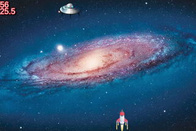

This project was bootstrapped with [webpack-es6-boilerplate](https://github.com/jluccisano/webpack-es6-boilerplate)

It is a small space battleship 2D game made for educatinal purpose.

It uses the following js librairies: 

pixi-js for easy manipulation of canvas tag
howler for easy manipulation of mp3 sounds data in the browser

the game is easily inserted in any project :

import App from './App';

const SpaceBattleship = new App();
window.onload = SpaceBattleship.load();